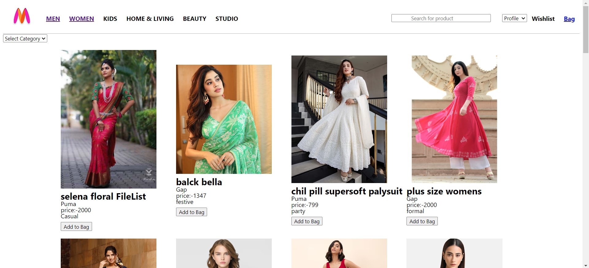

# Myntra Clone Project

Welcome to the Myntra Clone project! This project is a front-end replication of the Myntra website, built using HTML, CSS, and JavaScript.

## Table of Contents

- [Demo](#demo)
- [Features](#features)
- [Tech Stack](#tech-stack)
- [Installation](#installation)


## Demo

You can check out a live demo of the project <a href ="https://biman-pakhira.github.io/MyntraClone/"> here </a>.

### Home Section 


### Women Section


### SignUp Section


### Bag Section

## Features

- Responsive design that works on all devices
- User-friendly interface
- Product listings with categories
- Search functionality
- Product details page
- Cart functionality
- Basic user authentication (Login/Signup pages)

## Tech Stack

- **HTML**: For creating the structure of the web pages.
- **CSS**: For styling the web pages.
- **JavaScript**: For adding interactivity and handling dynamic content.

## Installation

To get a local copy up and running, follow these steps:

1. **Clone the repository**

   ```bash
   git clone git@github.com:Biman-pakhira/MyntraClone.git
